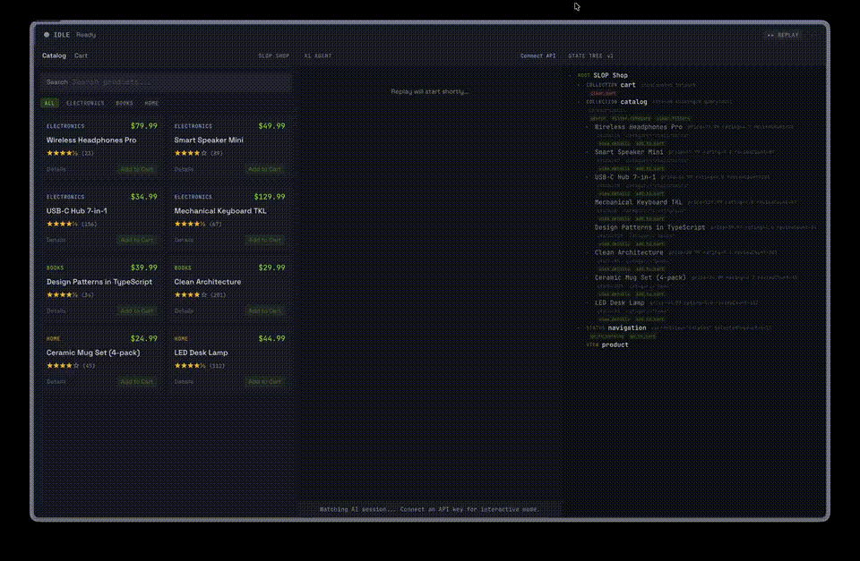

# SLOP — State Layer for Observable Programs

SLOP is a protocol that lets AI observe and interact with application state directly — no screenshots, no scraping, no blind tool calls.

Applications expose a **semantic state tree** that AI can subscribe to, query at variable depth, and act on through **contextual affordances**. It is the missing perception layer between AI and the software it operates.



> An AI agent observing state, invoking actions, and updating the UI in real time. Run it yourself: `bun demo`

## Why

Today, AI interacts with applications through two extremes:

- **Vision** (screenshots) — expensive, lossy, fragile. The AI parses pixels to recover information the app already had in structured form.
- **Tool calls / MCP** — the AI can act, but it's flying blind. It calls functions without knowing what the user is currently looking at or what the app's state is. Every observation requires a dedicated tool.

SLOP fills the gap: a standard way for apps to **publish what they are** so AI can **see before it acts**.

## Core ideas

1. **State tree** — Apps expose a tree of semantic nodes (not UI elements, not raw data models — meaning). Each node has an identity, properties, and optional children.

2. **Subscriptions and patches** — AI subscribes to subtrees at a chosen depth. The app pushes incremental patches (JSON Patch) as state changes. No polling, no redundant full reads.

3. **Contextual affordances** — Actions live on the nodes they affect, not in a global tool registry. The AI sees what it can do *in context* — "reply" appears on a message node, "merge" appears on a PR node.

4. **Attention hints** — Apps signal what matters right now: salience scores, change flags, user focus. The AI doesn't have to scan the entire tree to find what's relevant.

5. **Progressive disclosure** — The tree supports variable-depth queries. Top-level gives a summary. Drilling in gives detail. Large collections are windowed with summaries.

## How it differs from existing approaches

| | MCP / Tool calls | Accessibility APIs | SLOP |
|---|---|---|---|
| Primary purpose | AI acts | Screen readers read UI | AI perceives + acts |
| Data model | Flat list of functions | UI element tree | Semantic state tree |
| Direction | Pull (AI calls tools) | Pull (reader queries) | Push-first (app publishes) |
| Actions | Global tool registry | Limited (click, type) | Contextual affordances on nodes |
| Designed for | LLM function calling | Sequential text navigation | AI state comprehension |

## Quick start

```bash
bun add @slop-ai/client @slop-ai/react
```

```tsx
import { createSlop } from "@slop-ai/client";
import { useSlop } from "@slop-ai/react";

const slop = createSlop({ id: "my-app", name: "My App" });

function TaskList({ tasks }) {
  useSlop(slop, "tasks", {
    type: "collection",
    props: { count: tasks.length },
    items: tasks.map(t => ({
      id: t.id,
      props: { title: t.title, done: t.done },
      actions: {
        toggle: () => toggleTask(t.id),
        delete: () => deleteTask(t.id),
      },
    })),
  });

  return <ul>{tasks.map(t => <li key={t.id}>{t.title}</li>)}</ul>;
}
```

That's it. Your component is now observable by any SLOP consumer — the Chrome extension, a desktop agent, or a custom AI integration.

## Spec

The full specification is in [`spec/`](./spec/):

### Core protocol

1. [Overview & Concepts](./spec/core/overview.md)
2. [State Tree](./spec/core/state-tree.md)
3. [Transport & Discovery](./spec/core/transport.md)
4. [Message Protocol](./spec/core/messages.md)
5. [Affordances](./spec/core/affordances.md)
6. [Attention & Salience](./spec/core/attention.md)

### Extensions

- [Scaling](./spec/extensions/scaling.md) — windowing, pagination, view-scoped trees
- [Content References](./spec/extensions/content-references.md) — lazy-loaded media, URI schemes
- [Async Actions](./spec/extensions/async-actions.md) — long-running operations, progress tracking

### Integration guides

- [Adapters](./spec/integrations/adapters.md) — wrapping existing apps
- [Web](./spec/integrations/web.md) — browser integration, postMessage, security tiers
- [Desktop](./spec/integrations/desktop.md) — Unix sockets, native messaging
- [Agents](./spec/integrations/agents.md) — LLM interaction patterns
- [OpenClaw](./spec/integrations/openclaw.md) — OpenClaw plugin architecture

## SDKs

| Language | Package | Install |
|----------|---------|---------|
| TypeScript | [`@slop-ai/core`](./packages/typescript/core) | `bun add @slop-ai/core` |
| React | [`@slop-ai/react`](./packages/typescript/react) | `bun add @slop-ai/react` |
| Vue | [`@slop-ai/vue`](./packages/typescript/vue) | `bun add @slop-ai/vue` |
| Solid | [`@slop-ai/solid`](./packages/typescript/solid) | `bun add @slop-ai/solid` |
| Angular | [`@slop-ai/angular`](./packages/typescript/angular) | `bun add @slop-ai/angular` |
| Server (Node/Bun) | [`@slop-ai/server`](./packages/typescript/server) | `bun add @slop-ai/server` |
| Browser | [`@slop-ai/client`](./packages/typescript/client) | `bun add @slop-ai/client` |
| Consumer | [`@slop-ai/consumer`](./packages/typescript/consumer) | `bun add @slop-ai/consumer` |
| TanStack Start | [`@slop-ai/tanstack-start`](./packages/typescript/tanstack-start) | `bun add @slop-ai/tanstack-start` |
| Python | [`slop-ai`](./packages/python/slop-ai) | `pip install slop-ai` |
| Rust | [`slop-ai`](./packages/rust/slop-ai) | `cargo add slop-ai` |
| Go | [`slop-go`](./packages/go/slop-ai) | `go get github.com/slop-ai/slop-go` |

## Project structure

```
slop/
├── spec/                           # Protocol specification (14 docs)
├── packages/
│   ├── typescript/
│   │   ├── core/                   # @slop-ai/core — types, tree assembly, diffing
│   │   ├── client/                 # @slop-ai/client — browser provider (postMessage)
│   │   ├── server/                 # @slop-ai/server — server provider (WebSocket, Unix, stdio)
│   │   ├── consumer/               # @slop-ai/consumer — connect to providers, subscribe, invoke
│   │   ├── react/                  # @slop-ai/react — useSlop hook
│   │   ├── vue/                    # @slop-ai/vue — useSlop composable
│   │   ├── solid/                  # @slop-ai/solid — useSlop primitive
│   │   ├── angular/                # @slop-ai/angular — useSlop with signals
│   │   ├── tanstack-start/         # @slop-ai/tanstack-start — SSR adapter
│   │   └── openclaw-plugin/        # @slop-ai/openclaw-plugin — OpenClaw integration
│   ├── python/slop-ai/             # Python SDK
│   ├── rust/slop-ai/               # Rust SDK
│   └── go/slop-ai/                 # Go SDK
├── extension/                      # Chrome extension (SLOP consumer + AI chat)
├── desktop/                        # Tauri desktop app
├── examples/
│   ├── demo/                       # Interactive three-panel demo (bun demo)
│   ├── cli/                        # Task manager CLI in 4 languages (Bun, Python, Go, Rust)
│   ├── notes-spa/                  # React SPA with in-browser SLOP
│   └── tanstack-start/             # Full-stack SSR example
└── website/
    ├── landing/                    # slopai.dev landing page
    └── docs/                       # docs.slopai.dev documentation
```

## Examples

Each example follows a **blueprint** — a language-agnostic spec defining the exact SLOP tree, affordances, and test scenarios. Multiple implementations of the same blueprint prove cross-language consistency.

- **[Interactive Demo](./examples/demo/)** — Three-panel demo: e-commerce store + AI agent + live state tree. Run with `bun demo`. Replay mode works without an API key; connect one for interactive mode.
- **[CLI Task Manager](./examples/cli/)** — `tsk`, a task manager with a `--slop` flag. Implementations in Bun, Python, Go, and Rust.
- **[Notes SPA](./examples/notes-spa/)** — React app with in-browser SLOP provider via postMessage.
- **[TanStack Start](./examples/tanstack-start/)** — Full-stack web app with server-side SLOP via WebSocket.

## Roadmap

- Firefox extension
- Safari extension
- OpenClaw integration
- Agent CLI (`npx @slop-ai/init`)
- Extension per-site toggles

## License

MIT
